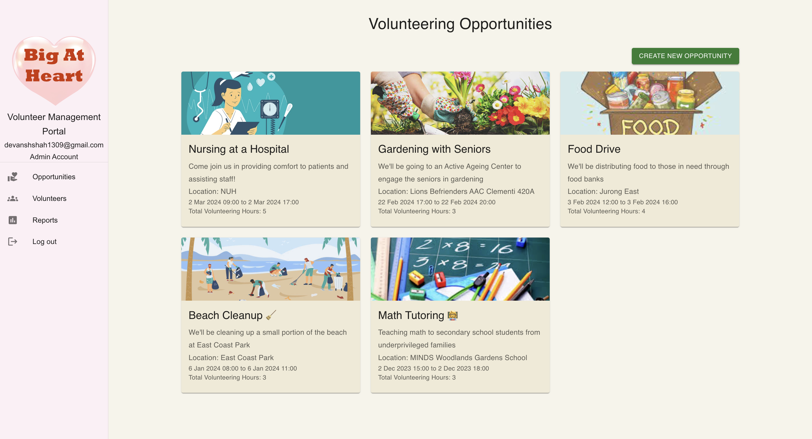
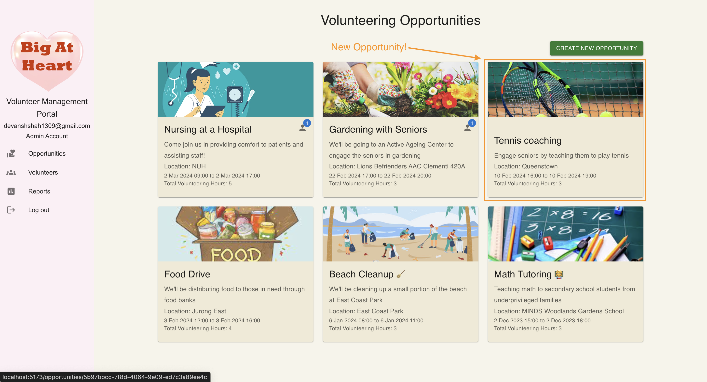
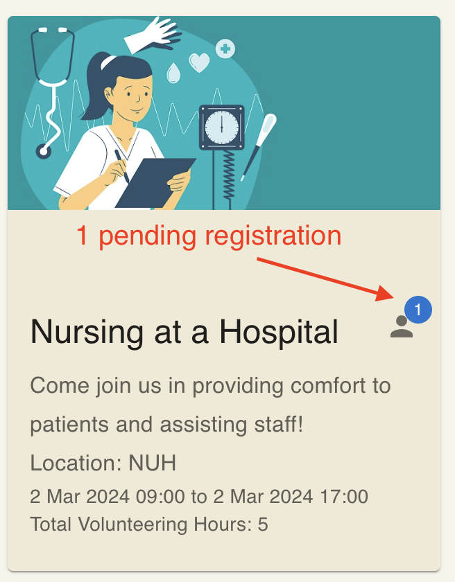
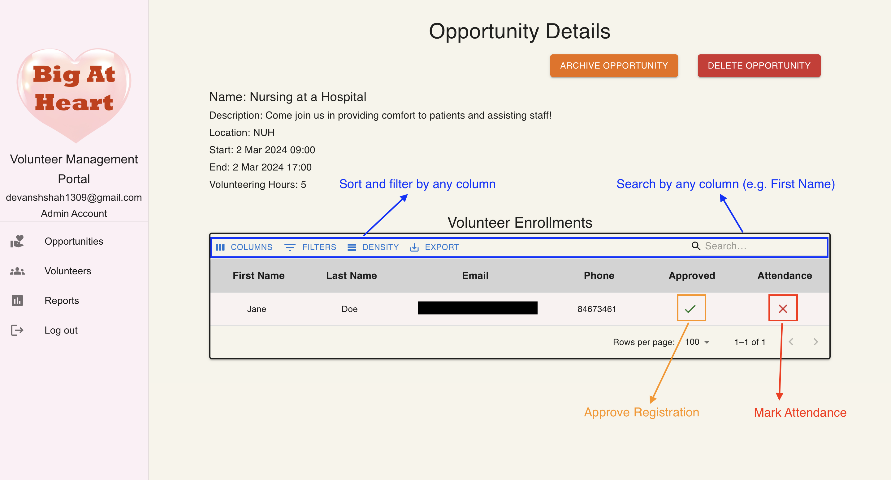
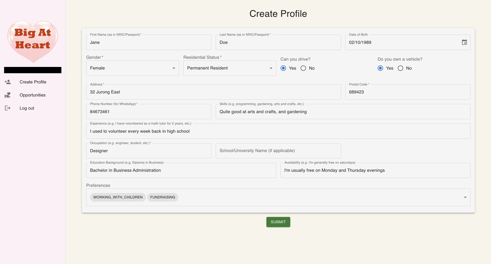
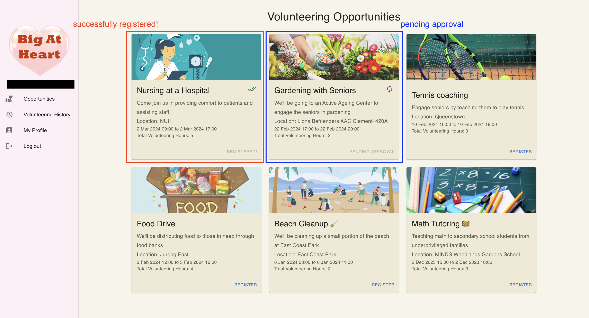

<h1 align="center">
Welcome to VolunTech Connect! 🚀
</h1>

VolunTech Connect is a platform that helps Non-Profit Organisations such as [Big At Heart](https://www.bigatheart.org/) to effortlessly manage volunteers, create opportunities for volunteers to sign up for, and so much more! 🌟

Say goodbye 👋 to the days of manually managing volunteers and opportunities. VolunTech Connect is here to help you automate and streamline the process. 🚀

Built with ❤️ by Joe and Devansh.

**Table of Contents**

- [Quick Start](#quick-start)
- [Core Features](#core-features)
  - [Admin](#admin)
    - [Create Opportunities](#create-opportunities)
    - [Approve Volunteer Registrations](#approve-volunteer-registrations)
    - [Archive Opportunities](#archive-opportunities)
    - [Delete Opportunities](#delete-opportunities)
    - [Manage Volunteers](#manage-volunteers)
    - [View Volunteer's Details and History](#view-volunteers-details-and-history)
    - [View Summary Statistics ⭐️](#view-summary-statistics-️)
  - [Volunteer](#volunteer)
    - [Sign up and Create Profile](#sign-up-and-create-profile)
    - [Register for Opportunities](#register-for-opportunities)
    - [View Personal Volunteering History](#view-personal-volunteering-history)
    - [Download Certificates ⭐️](#download-certificates-️)
- [Tech Stack](#tech-stack)
  - [Frontend](#frontend)
  - [Backend](#backend)

---

# Quick Start

Here's a short video on _why_ we built VolunTech Connect and how you can use it:\

https://github.com/Devanshshah1309/hack4good-2024/assets/59191109/ffe4679b-794f-439e-bf2e-d753c4016773

You can download the slides used in the presentation [here](./assets/VolunTech%20Connect%20Pitch%20Deck.pdf).

# Core Features

In this user guide, we explain the core features of our application from the perspective of (1) an admin and, (2) a volunteer.

> 💡 **Pro Tip**: For the best experience, use a laptop/desktop while using the application.

Let's dive in! 🏊‍♂️

## Admin

You cannot create an admin account through the application (for obvious security reasons). The admin account is created manually by the developers.

This is how the admin view looks like:

### Create Opportunities

Creating a new opportunity only takes one click! 🖱️

Fill in the necessary details such as:

- Name of the opportunity
- Description: you can include any relevant information such as what the volunteers will be doing, the maximum number of volunteers who can sign up, registration deadline, etc. here.
- Start and end date (and time) of the opportunity 📆
- Location of the opportunity 📍
- Number of volunteering hours each volunteer will receive (this may be different from the actual duration of the opportunity, depending on the nature of the work)

and that's it! You've created an opportunity! 🎉

> :warning: Note: The capacity and registration deadline are not enforced by the system. The admin can manage the number of volunteers who can sign up for an opportunity and the deadline for registration.

By default, opportunities are sorted by the start date in reverse chronological order, so the latest opportunities will appear at the top of the list.

> 💡 **Pro Tip**: You can also add a photo to make your opportunity more appealing to volunteers!

Here's a quick tutorial on how to create an opportunity:

Once created, you should see it in the list of opportunities, as shown below:

To manage a particular opportunity, simply click on the opportunity name to view all the details and manage the registrations.

### Approve Volunteer Registrations

When volunteers sign up for an opportunity, their registration is not automatically approved. This is to give the admin the flexibility to manage the number of volunteers who can sign up for an opportunity.

> 💡 **Pro Tip**: When there are pending registrations which have not yet been approved, there will be an icon visible on the main opportunities page.

This is how it looks like:

For each opportunity, the admin can view a list of all volunteers who have registered for the opportunity. The admin can then approve the registrations of selected volunteers.

On the day of the event, the admin can also mark the attendance of the volunteers who showed up for the event.

As a quick summary, here are some of the actions you can take for any opportunity:

> 💡 **Pro Tip**: Once the admin has marked attendance for a volunteer, the volunteer can download a certificate for volunteering for that opportunity!

### Archive Opportunities

We know that opportunities come and go. Once an opportunity has finished, the admin can easily archive it. This will remove the opportunity from the main opportunities page, but will not delete the data from the system. This is a great way to keep your opportunities page clean and easy to navigate!

> Note: Archived opportunities can still be viewed in a volunteer's personal history, and continues to count towards the total volunteering hours (and all other statistics).

### Delete Opportunities

If you accidentally created an opportunity, or if you simply want to remove an opportunity from the system, you can easily delete it. This will remove the opportunity from the system entirely, including all data associated with it (e.g., volunteer registrations)

> :warning: Warning: Once an opportunity is deleted, it cannot be recovered. So, be careful when deleting opportunities!

### Manage Volunteers

No more hunting through spreadsheets to find a volunteer's details!

You can easily **search**, **sort**, **filter**, and **view** all the details of your volunteers in one place. Oh, and did we forget to mention? You can also **download a CSV** of all your volunteers' details if you wish to export it!

We're not joking when we say that this really is a superpower! 🦸‍♂️ Don't believe us? See it in action (and imagine you have thousands of volunteers!):

https://github.com/Devanshshah1309/hack4good-2024/assets/59191109/eb1c678a-96c6-4e42-bf0c-caa2e0b9e211

### View Volunteer's Details and History

Want to know more about a volunteer? Simply click on their name to view their details and volunteering history. You can see _all_ their profile details, as well as a list of all the opportunities they registered for. You can even sort and filter this list to find the information you need!

> 💡 Note: "Registered" is not the same as "attended". A volunteer may have registered for an opportunity but the admin may decide to not approve their registration (e.g. due to capacity reasons) or the volunteer did not show up for the event. Hence, a volunteer is said to have "attended" an event only if the admin has approved their registration _and_ marked attendance.

### View Summary Statistics ⭐️

Curious to see the overall statistics of your volunteers and opportunities? We've got you covered! 😄

You can view the distribution of volunteers by:

- Age
- Gender
- Preferences (i.e., what type of opportunities are volunteers interested in)
- Immigrant status

You can also view how well your organisation is doing in terms of:

- Number of opportunities created in the past 6 months
- Number of volunteer attendances in the past 6 months

And of course, you can easily save these charts: simply right-click and "save as image" to add them to your reports and presentations!

Here's how it looks:

https://github.com/Devanshshah1309/hack4good-2024/assets/59191109/bbda5dbd-d982-4c2a-a4ff-2320d9e4cd66

## Volunteer

### Sign up and Create Profile

As a volunteer, you can easily sign up and create your profile. You just have to fill out a form and you're good to go! 🚀

And don't worry, you can always come back and update your profile details later if you need to.

> :warning: Note: You cannot update important personal information such as your first name, last name, email address, and date of birth. So, make sure you fill these in correctly when you sign up!

Here's an image of what the sign up form looks like:

### Register for Opportunities

Once you've signed up and created your profile, you can easily browse through all the opportunities available to you.

All you have to do is click "Register" to sign up for an opportunity. It's that simple! 🎉

Once you've registered for an opportunity, the admin will review your registration and approve it. Once approved, you can view the opportunity in your personal volunteering history.

> Note: There are 3 main statuses for a volunteer's registration for an opportunity:
>
> - Pending: The volunteer has registered for the opportunity but the admin has not yet approved their registration
> - Registered: The admin has approved the volunteer's registration for the opportunity
> - Attended: The volunteer has attended the opportunity

Here's how it looks on your dashboard:

### View Personal Volunteering History

Once you've attended an opportunity, you can view it in your personal volunteering history. This is a great way to keep track of all the opportunities you've volunteered for and to motivate yourself to continue volunteering! 🌟

To make it even easier, you can sort and filter your personal volunteering history to find the information you need.

### Download Certificates ⭐️

Once the admin has marked your attendance for an opportunity, you can **download a certificate** for volunteering for that opportunity _without troubling the admin_.

You can even post these online to convince your friends to join you in volunteering! 📢

https://github.com/Devanshshah1309/hack4good-2024/assets/59191109/eafb569a-3d11-45bc-88ee-2451e68bda37

> 💡 **Pro Tip**: Admins, this means that you don't have to manually create certificates for volunteers anymore! Hope this saves you a lot time :)

# Tech Stack

Our application uses **modern enterprise-grade technologies** to ensure that it is **secure**, **scalable**, and **easy to maintain**.

We use third-party services to handle authentication and database management to guarantee that your data is secure and always available.

We're confident that our application can handle upto hundreds of thousands of volunteers and opportunities without breaking a sweat! 🚀

Oh, and did we mention that our entire tech stack is **completely free**! We don't use any paid tools or libraries, which means we can run this free of cost _forever_.

## Frontend

- **React**: A popular JavaScript library for building user interfaces
- **TypeScript**: A superset of JavaScript that adds static types to the language, making it easier to catch bugs early and write more maintainable code
- **Vite**: A modern build tool that is faster than Webpack and Parcel
- **Material-UI**: A popular React UI framework that provides a set of components and styles to build beautiful and responsive user interfaces

## Backend

- **NestJS**: A modern Node.js framework for building scalable and maintainable server-side applications
- **TypeScript**: A superset of JavaScript that adds static types to the language, making it easier to catch bugs early and write more maintainable code
- **Prisma ORM**: A modern database toolkit that provides a type-safe way to interact with your database using TypeScript
- **MySQL**: A popular open-source relational database management system
- **PlanetScale**: A cloud-hosted database service that provides a fully managed MySQL database

In particular, we use **Clerk** for authentication. Clerk is a third-party service that provides authentication and user management, along with integration with popular identity providers such as Google, Facebook, and more. This means that we never have to worry about the security of our authentication system, and we can focus on building the core features of our application. It also means that **we also don't store any passwords in our database**, which is a huge security win!
